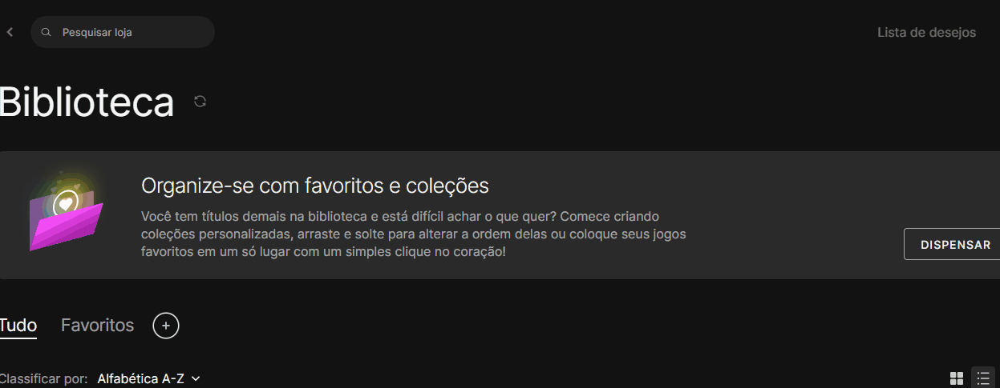

# Projeto com README
Um projeto de teste com um arquivo README
🎃

[](https://:google.com)

## Tecnologias utilizadas
- HTML
- CSS
- JS
## Como utilizar
Clone pro projeto
```
git clone <url>
```

Acesse a pasta do projeto
```
cd repositorio-com-readme
```